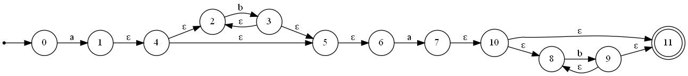
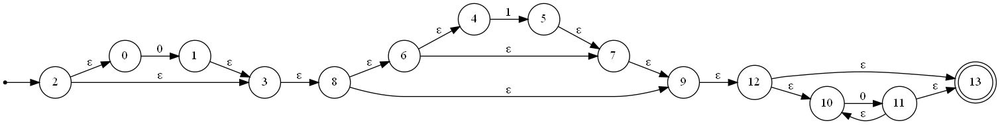
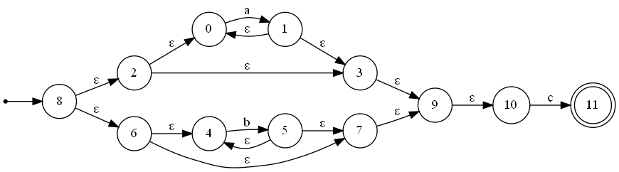
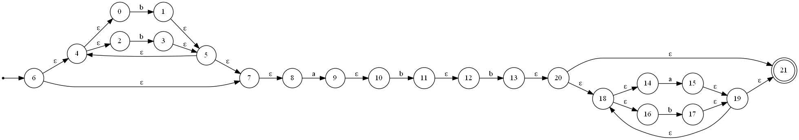
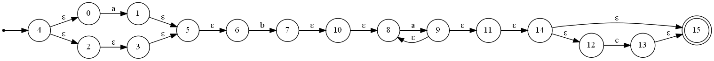
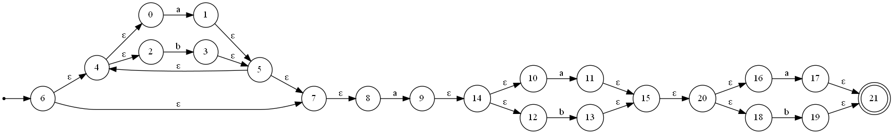

# NecoLanguage
NecoLanguage will be a programming language that is designed to be easy to learn and easy to use.

# Laboratorio A
This is the first laboratory of the NecoLanguage project. It manages a regular expression and creates a NFA from it.

## Characteristics
- Has a regular expression parser. (It changes the regular expression to a postfix expression)
- Has a NFA creator. (It creates a NFA from a postfix expression using McNaughton-Yamada-Thompson's algorithm)
- Visualizes the NFA. (It uses Graphviz to visualize the NFA)

## How to use it
- You need to have Graphviz installed.
- You need to have Python 3 installed.

### Steps
1. Open the command prompt.
2. Go to the directory where the files are.
3. Install the requirements with `pip install -r requirements.txt`
4. Type `python main.py` and press enter.
5. Type the regular expression and press enter.
6. The NFA will be created and saved in the `output.gv.png` file.
7. NFA's description will be saved in the `output.txt` file.

## Examples (Also known as pre-lab) 
Description and transition tables found at `PreLab/{Number}.txt`. Ej. `PreLab/First.txt` is the description of the first example.
### First `ab*ab*` 

### Second `0?(1?)?0*` 

### Third `(a*|b*)c`

### Fourth `(b|b)*abb(a|b)*`

### Fifth `(a|ε)b(a+)c?`

### Sixth `(a|b)*a(a|b)(a|b)`

